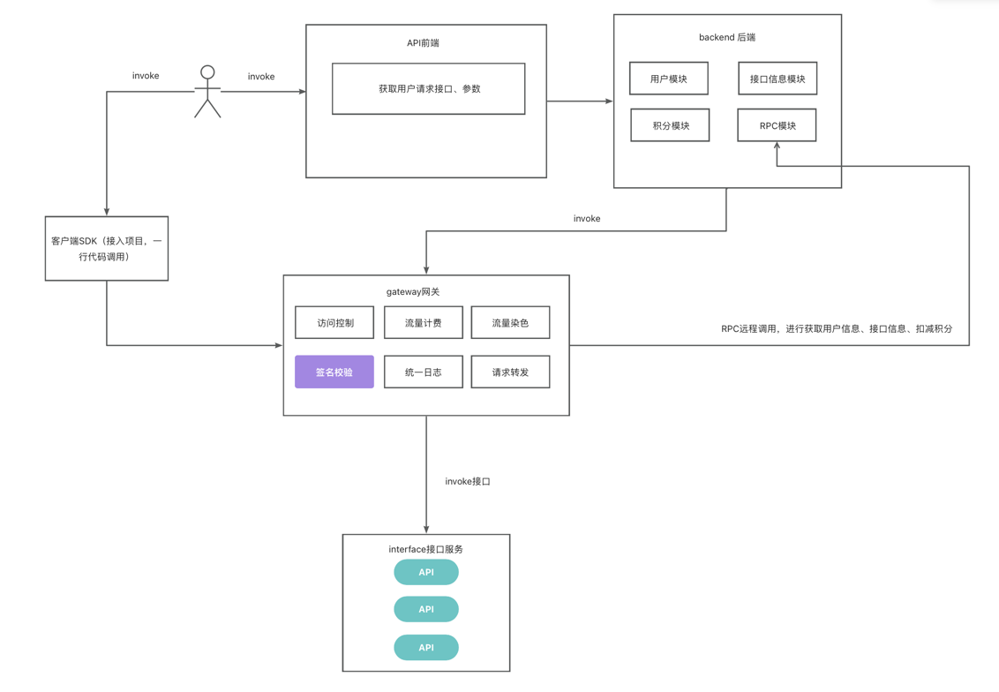
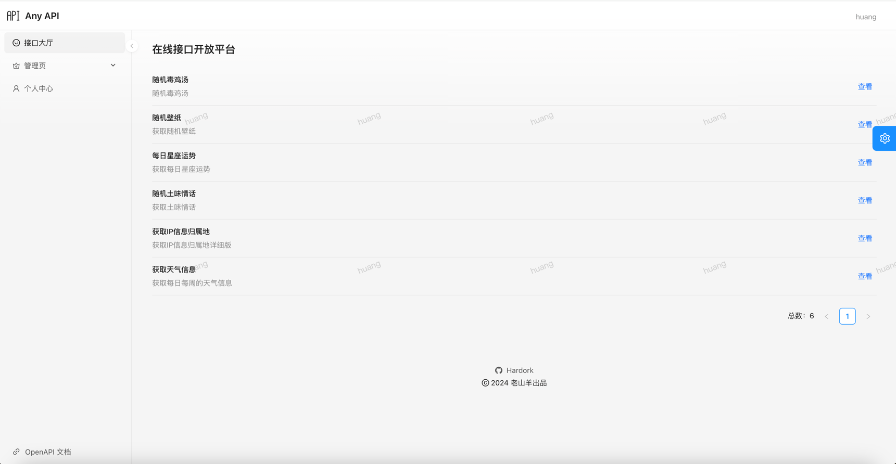
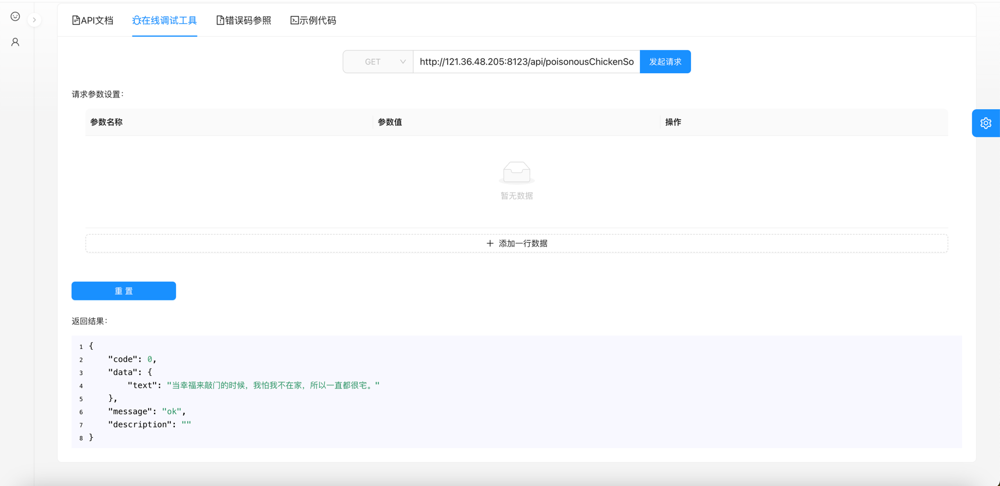
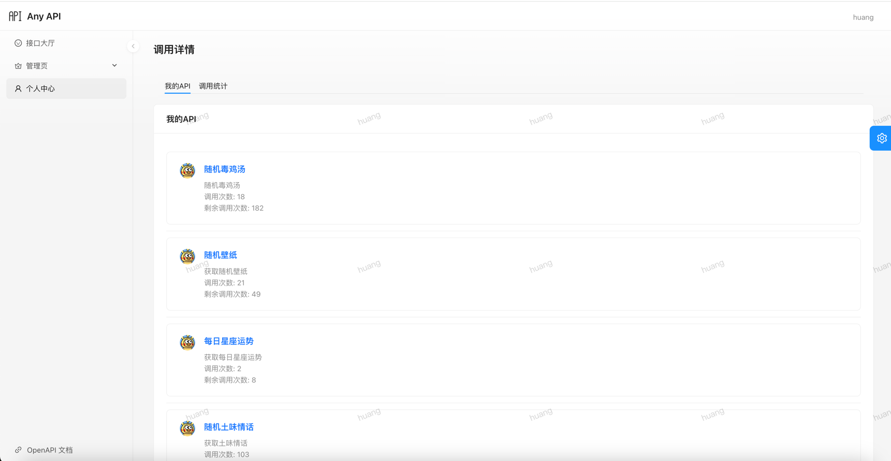
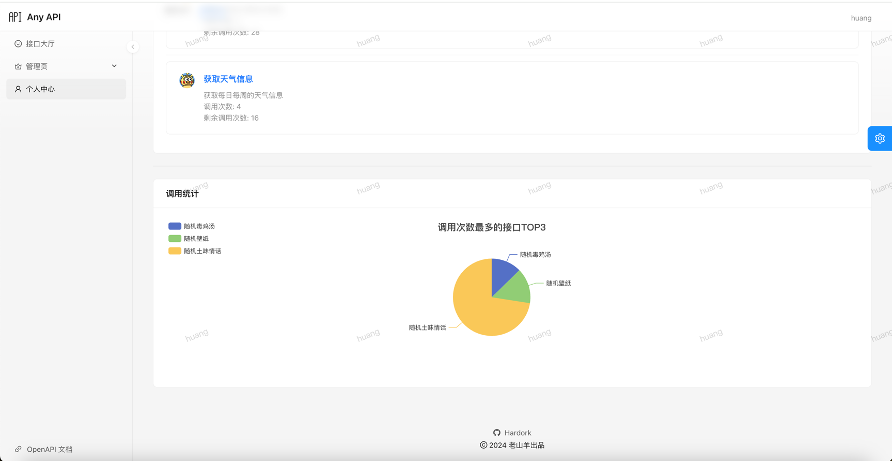

# AnyAPI
<h1 align="center"></h1>

<strong>AnyAPI接口开放平台致力于提供稳定、安全、高效的接口调用服务，帮助您实现更快速、便捷的开发和调用体验 🛠</strong>

> 在线访问：[AnyAPI](http://121.36.48.205/)  
> 作者：[老山羊](https://github.com/Hardork)

## 项目背景
<strong>
在前端开发者需要一些接口服务时，可以不需要自己编写后端接口？同样后端开发者如果想要快速使用一些较难开发的服务如何实现？Any API所做的就是在安全的基础下提供稳定高效的接口服务，帮助开发者实现快速便捷的开发和极致的调用体验🛠</strong>

## 项目功能介绍

- **接口信息查看**，在接口大厅可查看接口简介
- **接口在线调用**，在接口详情页，可在线调用接口，查看接口响应内容
- **通过SDK调用接口**，在接口详情页可获取如何使用SDK调用接口
- **积分获取与消费**，积分获取，用户可通过每日签到获取积分，也可通过购买获取积分；积分消费，调用接口会消耗积分

## 项目选型 🎯

### **后端**
- Spring Boot 2.7.0
- Spring MVC
- MySQL 数据库
- Redis 缓存
- 腾讯云COS存储
- Dubbo 分布式（RPC、Nacos）
- Spring Cloud Gateway 微服务网关
- Spring Boot Starter（SDK开发）
- Swagger + Knife4j 接口文档
- Apache Commons Lang3 工具类
- MyBatis-Plus 及 MyBatis X 自动生成
- Hutool、Apache Common Utils、Gson 等工具库

## 目录结构 📑

| 项目目录                                         | 描述    |
|----------------------------------------------|-------|
| **[goat-api-backend](./goat-api-backend)**   | 后端模块  |
| **[goat-api-common](./goat-api-common)**     | 公共模块  |
| **[goat-api-gateway](./goat-api-gateway)**   | 网关模块  |
| **[goat-api-interface](./goat-api-gateway)** | 接口模块  |
| **[sql](./sql)**                             | 数据库建表 |

### 后端

1. 执行sql目录下db.sql
2. 更改配置文件application.yml中打上xxx的属性值

#### 调用API流程

#### 接口大厅

#### 接口详情

#### 在线调试

#### 查看调用详情

